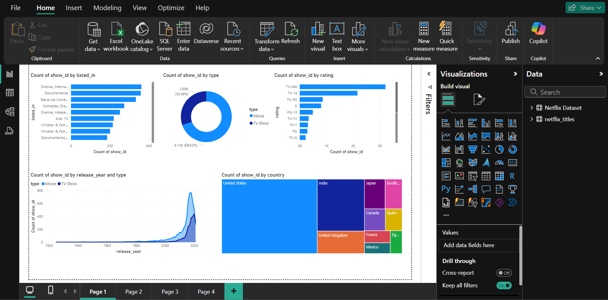
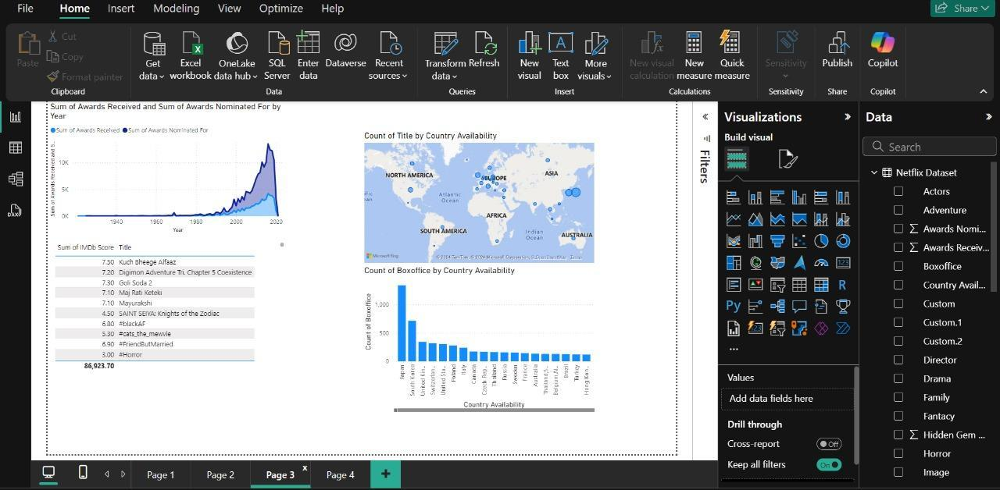
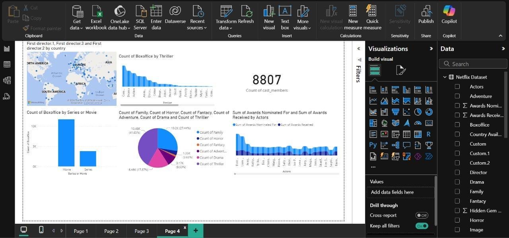

# Investigating Netflix Movies and Guest Stars in The Office

## 📌 Project Overview
This project analyzes Netflix's movie catalog and guest star appearances in *The Office* using **Power BI**. The goal is to uncover trends in content distribution, audience preferences, and the impact of guest actors on viewership.

## 📊 Key Insights
- **Netflix Trends**: Analyzed genre popularity, release patterns, and regional availability.
- **The Office Guest Stars**: Explored correlations between guest star appearances and audience ratings.
- **Content Growth**: Significant increase in content releases in recent years due to the rise of streaming platforms.
- **Popular Genres**: Dramas, Documentaries, and Comedies dominate Netflix’s catalog.
- **Content Ratings**: TV-MA and TV-14 rated content is the most prevalent, indicating a focus on mature audiences.
- **Box Office Performance**: Movies generally perform better in box office revenue, while TV shows gain steady long-term engagement.

## 🔍 Data Sources
- [`Netflix_titles.csv`](https://github.com/saliniyan/DA_PROJECT/blob/main/netflix_titles.csv) – Contains details on movies and TV shows available on Netflix.
- [`Netflix Dataset.csv`](https://github.com/saliniyan/DA_PROJECT/blob/main/Netflix%20Dataset.csv) – Includes additional metadata for content analysis.

## 📈 Live Dashboard
[View Dashboard](https://app.powerbi.com/groups/me/reports/7cacb9c3-45d7-4f75-8246-43d7b199c19d/bfd3b34708a27493795a)

## 📸 Screenshots

### Page 1

### Page 2
 

### Page 3

### Page 4

